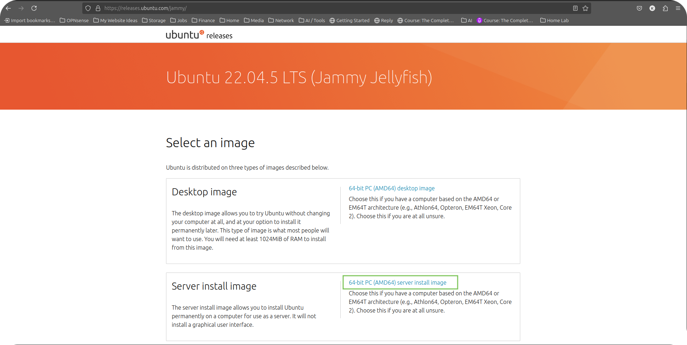
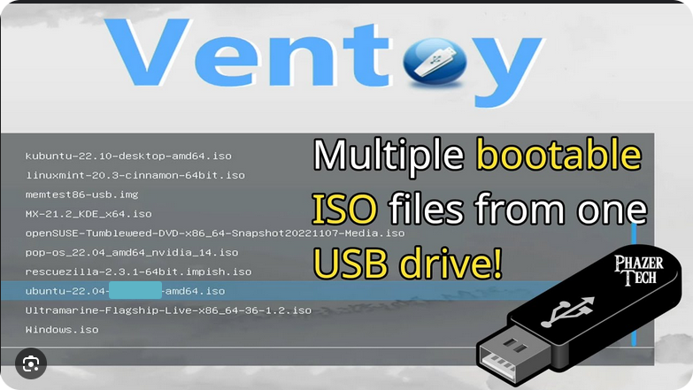
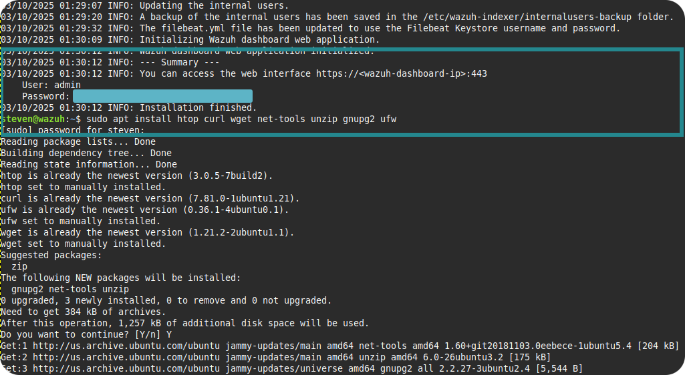
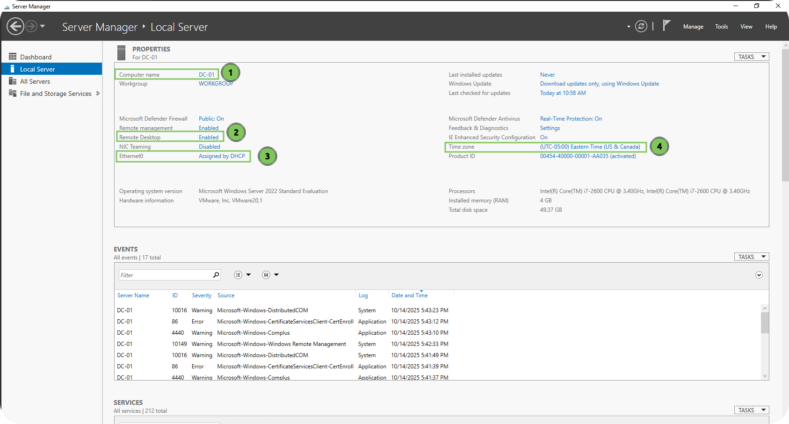
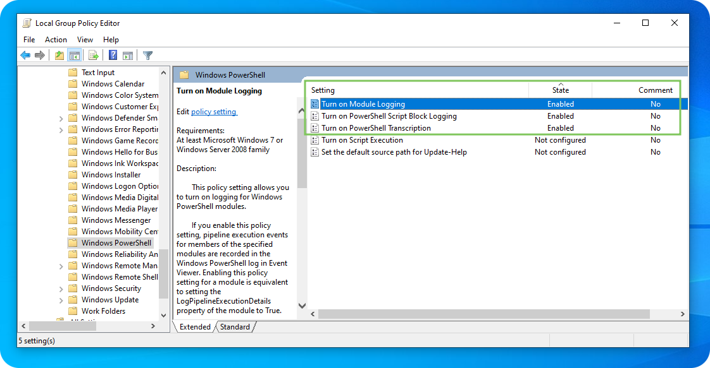
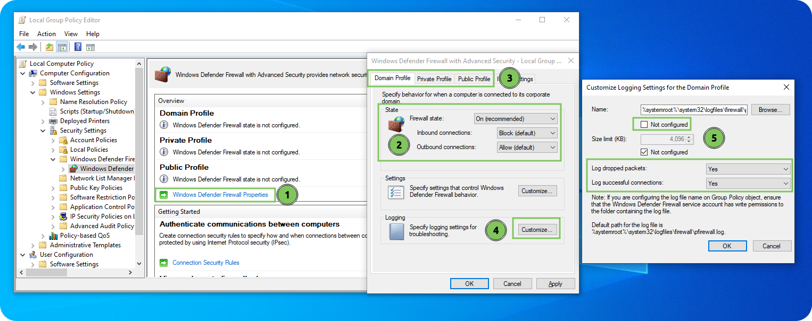
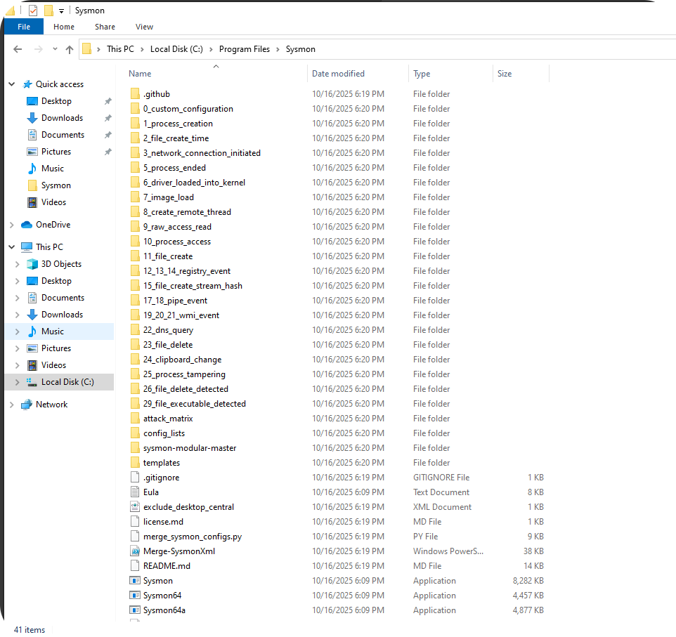
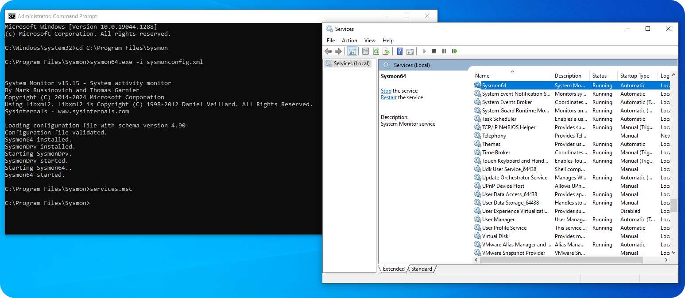
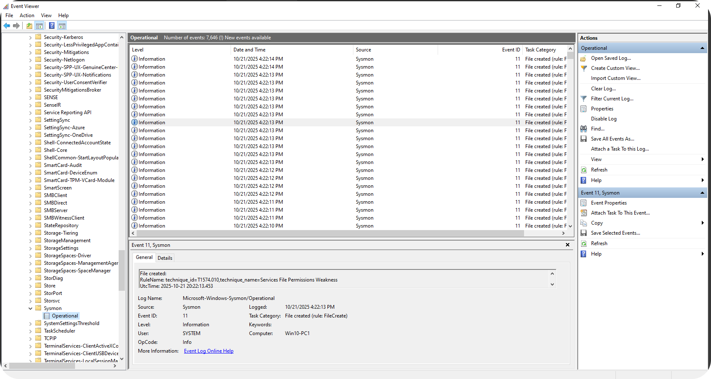
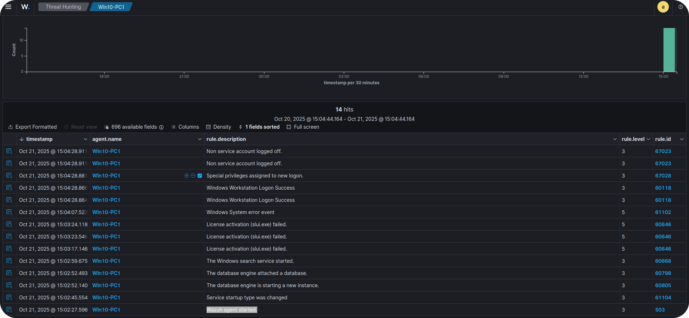

### [Home](https://github.com/Komonodrg-portfolio)  | [Cybersecurity](https://github.com/Komonodrg-portfolio/Cybersecurity) | [Networking](https://github.com/Komonodrg-portfolio/Networking) | [Data Science (AI)](https://github.com/Komonodrg-portfolio/AI) | [Media Creation](https://github.com/Komonodrg-portfolio/MediaCreation) | [Mission](https://github.com/Komonodrg-portfolio/Mission/)

---
---

# Wazuh SIEM & XDR Deployment  

## 📌 Goals
This project demonstrates the deployment of a standalone **Wazuh SIEM & XRD instance**  in order to holistically triage of systems (windows, linux) and network in order to strengthen my skills while seeking to become a Cybersecurity professional. In conjuction with aligning with principles of my [mission](https://github.com/Komonodrg-portfolio/Mission/), my aim is to deploy on hardware already possessed.  

It highlights skills in:
- Barebone deployment, for dedicated security device with firewall lockdown implementation
- Virtualization and hypervisor management (**VMWare**)
- Active Directory administration 
- Security Information and Event Management (**Wazuh**)
- Actions against unified view of threats and automates remediation (**XDR**) 
- System (OS) administration and Windows/Linux server setup  
- Log collection, monitoring, and security alerting

---
## 🧰 Tools & Technologies

| Tool       | Purpose                              |
|------------|--------------------------------------|
| VMWare Workstation | Type-2 hypervisor for virtualization         |
| Wazuh | Open-source SIEM & XDR platform         |
| Debian/Ubuntu    | Guest OS for Wazuh server          |
| Nginx  | Reverse proxy for web dashboard (optional)                      |
| Suricata, Wazuh, Syslog  | Log collection and injestion agents and protocol         |


---

## 📂 Topology

---

## 🛠️  Setup Instructions
<details>
 <summary><h4><b>  A)  Wazuh Server (standalone) Deployment"</b></h4></summary>
  <br> 
This method involves installing Wazuh Server on a standalone PC/Laptop.  This deployment is best to use if you want a dedicated security appliance to monitor and protect your home network.<br>  
<br>
Create a <a href="https://chatgpt.com/s/t_68e1cb99a0088191bb1937e92241f81a" target="_blank">Ventoy USB drive</a> and boot PC/laptop off of a <a href="https://releases.ubuntu.com/jammy/" target="_blank">Ubuntu 22.04 Server.iso</a> file to intiate installation.  Make sure to be on network during installation and eventually after it completes installation, you'll need to install the Wazuh Server.<br>
<br>

<p float="center">
  
  
 
```
1) Ensure Ubuntu 22.04 is updated
   └─ sudo apt update && sudo apt upgrade -y

2) Ensure firewall (ufw) is active and  proper ports are open, allowing for proper communication of server
   └─ sudo ufw reset
   └─ sudo sudo ufw default deny incoming
      sudo ufw default allow outgoing
   └─ sudo ufw allow 1514/tcp
      sudo ufw allow 1514/udp
      sudo ufw allow 1515/tcp
      sudo ufw allow 443/tcp
      sudo ufw allow 9200/tcp
      sudo ufw allow 55000/tcp
      sudo ufw allow 22/tcp       #anti SSH lockout
   └─ sudo ufw enable
   └─ sudo ufw status verbose

3) Install dependencies:
   └─ sudo apt install curl apt-transport-https gnupg2 wget unzip -y

4) Install installation script and executable without pause:
   └─ curl -sO https://packages.wazuh.com/4.14/wazuh-install.sh
   └─ sudo bash ./wazuh-install.sh -a

```
 
You'll be granted with login instructions and credentials for Wazuh server web gui to access from the browser of another computer on the network:<br>
<br>
<p float="center">
  
          
          
</details>

<details>
 <summary><h4><b>  B)  Windows Server 2022 Setup</b></h4></summary>
  <br> 
This is intial setup of Windows Server 2022 from within VMWare. <br>  
<br>

 <p align="left">
  <br>
<br>

```
1) Change server name
   └─ Computer Name > click "Change..." > Enter new name > OK > Restart

2) Enable Remote Desktop (allowing vulnerability for extra log generation/events from within cyber range)
   └─ Remote Desktop > select "Allow remote connections to this computer"

3) Disable IPv6 while and setup static IP address & DNS for server
   └─ Ethernet0 > right click on network adapter, select "Properties" > uncheck "IPv6" >
      select IPv4 > Set up static IP & DNS servers

4) Change Time Zone
   └─ "Change time zone..." > select appropriately
```
</details>

<details>
 <summary><h4><b>  C)  Windows 10 (Victim) VM Setup</b></h4></summary>
  <br> 
<h4> Enable Powershell Logging </h4>  

 <p align="left">
  <br>

```
Startup gpedit.msc > Computer Configuration > Administrative Templates > Windows Powershell
   └─ Enable Module Logging, click "Show" and enter "*" wildcard to encompass all modules
   └─ Enable Powershell Transcription, placing a check for include invocation headers (timestamps)
   └─ Enable Script Block Logging DON'T enable invocation headers
```
<h4> Enable Firewall (Defender) Logging </h4> 

<p align="left">
  <br>

```
1) Startup gpedit.msc > Computer Configuration > Windows Settings > Windows Firewall w/ Advanced Security
   > Windows Defender Firewall Properties
2) Turn on Firewall, blocking inbound connections, allowing outbound connections
3) Do the same for Private & Public Profiles
4) Customize...
5) Remove check to enable Logs, select "Yes" for Log dropped packets & successful connections
6) ...Do the same on Private and Public Profiles
```
<h4> Enable SYSMON & OSQuery Logging </h4> 
<br>

1) Download [Sysmon](https://learn.microsoft.com/en-us/sysinternals/downloads/sysmon) and extract it to C:/Program Files/Sysmon folder<br>
2) Download [Olaf Hartong](https://github.com/olafhartong/sysmon-modular) sysmon configuration file and extract contents to C:/Program Files/Sysmon folder<br>

<p align="left">
  <br>

3) From CMD (administrative), navigate to C:/Program Files/Sysmon folder & run, which installs sysmon with olaf config file:
```
cd C:\Program Files\Sysmon
sysmon64.exe -i sysmonconfig.xml
```
4) Verify successful Sysmon installation and running via `services.msc` & `Event Viewer (Windows Logs > Application and Service Logs > Microsoft > Windows > Sysmon)`:

<p align="left">
  <br>

<p align="left">
  <br>

5) Download & Install [OSquery](https://osquery.io/downloads/official/5.19.0) for windows, select latest stable version & run installation.  Confirm successful installation:

<p align="left">
  <br>
   
<h4> Install Wazuh Agent </h4>

```
From within Windows VM, navigate to Wazuh server > Select "Deploy New Agent"
    └─ Select "Windows"
    └─ Put in Wazuh IP address in "Assign a server address" field
    └─ Enter Hostname for Win VM in "Assign an agent name field"
    └─ Copy command from "4) Run the following commands to download and install the agent" field
       and enter command into a Powershell (administrative) shell
    └─ Start agent by issuing command "NET START Wazuh"
    └─ Confirm injestion of logs from within Wazuh server (gui)
```
<p align="left">
  <br>

<h4> Send Sysmon & OSquery Logs to Wazuh Manager through Wazuh Agent </h4>

```
From within Windows VM, navigate to C:\Program Files (x86)\ossec-agent\ossec.conf (had to open via Notepad
- Run as admin) > add config lines to end of already configured <logfile> entries.  
    └─ For Sysmon:
       <localfile>
         <location>Microsoft-Windows-Sysmon/Operational</location>
         <log_format>eventchannel</log_format>
       </localfile>

                             -OR-

- Edit configuration file on Wazuh Server to reflect all agents in an agent grouping via adding config via
  nano /var/ossec/etc/shared/Windows<GroupWhereWindowsVMis>/agents.conf file & saving:  
    └─ <localfile>
         <location>Microsoft-Windows-Sysmon/Operational</location>
         <log_format>eventchannel</log_format>
       </localfile>
    └─ Verfify OK after saving of file via /var/ossec/bin/verify-agent-conf:

       wazuh@wazuh:/var/ossec/bin$ ./verify-agent-conf 

       verify-agent-conf: Verifying [etc/shared/Windows/agent.conf]
       verify-agent-conf: OK

       verify-agent-conf: Verifying [etc/shared/default/agent.conf]
       verify-agent-conf: OK

       verify-agent-conf: Verifying [etc/shared/Linux/agent.conf]
       verify-agent-conf: OK

```

<p float="center">
  
  


    └─ For OSquery:
       
    └─ Enter Hostname for Win VM in "Assign an agent name field"
    └─ Copy command from "4) Run the following commands to download and install the agent" field
       and enter command into a Powershell (administrative) shell
    └─ Start agent by issuing command "NET START Wazuh"
    └─ Confirm injestion of logs from within Wazuh server (gui)
```


