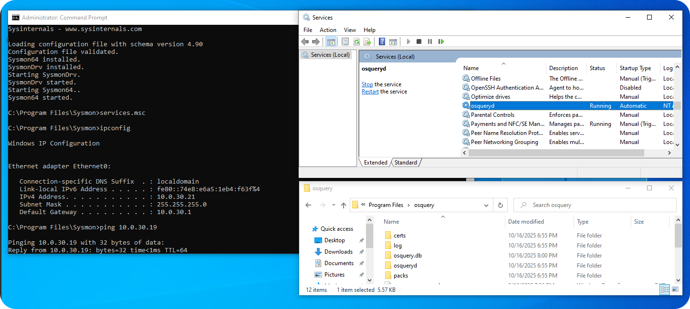

### [Home](https://github.com/Komonodrg-portfolio)  | [Cybersecurity](https://github.com/Komonodrg-portfolio/Cybersecurity) | [Networking](https://github.com/Komonodrg-portfolio/Networking) | [Data Science (AI)](https://github.com/Komonodrg-portfolio/AI) | [Media Creation](https://github.com/Komonodrg-portfolio/MediaCreation) | [Mission](https://github.com/Komonodrg-portfolio/Mission/)

---
---

# Wazuh SIEM & XDR Deployment  

## 📌 Goals
This project demonstrates the deployment of a standalone **Wazuh SIEM & XRD instance**  in order to holistically triage of systems (windows, linux) and network traffic in order to strengthen my skills while seeking to become a Cybersecurity professional. In conjuction with aligning with principles of my [mission](https://github.com/Komonodrg-portfolio/Mission/), my aim is to deploy on hardware already possessed.  

It highlights skills in:
- Barebone deployment, for dedicated security device with firewall lockdown implementation
- Virtualization and hypervisor management (**VMWare**)
- Active Directory administration 
- Security Information and Event Management (**Wazuh**)
- Actions against unified view of threats and automates remediation (**XDR**) 
- System (OS) administration and Windows/Linux server setup  
- Log collection, monitoring, and security alerting

---
## 🧰 Tools & Technologies

| Tool       | Purpose                              |
|------------|--------------------------------------|
| VMWare Workstation | Type-2 hypervisor for virtualization         |
| Wazuh | Open-source SIEM & XDR platform         |
| Debian/Ubuntu    | Guest OS for Wazuh server          |
| Nginx  | Reverse proxy for web dashboard (optional)                      |
| Suricata, Wazuh, Syslog  | Log collection and injestion agents and protocol         |


---

## 📂 Topology

---

## 🛠️  Setup Instructions
<details>
 <summary><h4><b>  A)  Wazuh Server (standalone) Deployment</b></h4></summary>
  <br> 
This method involves installing Wazuh Server on a standalone PC/Laptop.  This deployment is best to use if you want a dedicated security appliance to monitor and protect your home network.<br>  
<br>
Create a <a href="https://chatgpt.com/s/t_68e1cb99a0088191bb1937e92241f81a" target="_blank">Ventoy USB drive</a> and boot PC/laptop off of a <a href="https://releases.ubuntu.com/jammy/" target="_blank">Ubuntu 22.04 Server.iso</a> file to intiate installation.  Make sure to be on network during installation and eventually after it completes installation, you'll need to install the Wazuh Server.<br>
<br>

<p float="center">
  
  
 

1) Ensure Ubuntu 22.04 is updated:
```
sudo apt update && sudo apt upgrade -y
```
2)  Ensure firewall (ufw) is active and  proper ports are open, allowing for proper communication of server:
```
sudo ufw reset
sudo sudo ufw default deny incoming
sudo ufw default allow outgoing
sudo ufw allow 1514/tcp
sudo ufw allow 1514/udp
sudo ufw allow 1515/tcp
sudo ufw allow 443/tcp
sudo ufw allow 9200/tcp
sudo ufw allow 55000/tcp
sudo ufw allow 22/tcp       #anti SSH lockout
sudo ufw enable
sudo ufw status verbose
```
3) Install dependencies:
```
sudo apt install curl apt-transport-https gnupg2 wget unzip -y
```
4) Install installation script and executable without pause:
```
curl -sO https://packages.wazuh.com/4.14/wazuh-install.sh
sudo bash ./wazuh-install.sh -a
```


 
You'll be granted with login instructions and credentials for Wazuh server web gui to access from the browser of another computer on the network:<br>
<br>
<p float="center">
  
          
          
</details>

<details>
 <summary><h4><b>  B)  Windows Server 2022 Setup</b></h4></summary>
  <br> 
This is intial setup of Windows Server 2022 from within VMWare. <br>  
<br>

 <p align="left">
  <br>
<br>

```
1) Change server name
   └─ Computer Name > click "Change..." > Enter new name > OK > Restart

2) Enable Remote Desktop (allowing vulnerability for extra log generation/events from within cyber range)
   └─ Remote Desktop > select "Allow remote connections to this computer"

3) Disable IPv6 while and setup static IP address & DNS for server
   └─ Ethernet0 > right click on network adapter, select "Properties" > uncheck "IPv6" >
      select IPv4 > Set up static IP & DNS servers

4) Change Time Zone
   └─ "Change time zone..." > select appropriately
```
</details>

<details>
 <summary><h4><b>  C)  Windows 10 (Victim) VM Setup</b></h4></summary>
  <br> 
<h4> Create Administrative Shortcuts </h4> 

Many of the configuration tasks required need administrative elevated applications.  For ease of startup, found it best to create administrative shortcuts on my desktop to:
- CMD
- Powershell
- Notepad
```
Right click on Desktop > New > Shortcut
  
To create shortcuts for required applications, repeat process for each application, for each enter:
  └─ CMD: C:\Windows\System32\cmd.exe
  └─ Powershell: C:\Windows\System32\WindowsPowerShell\v1.0\powershell.exe
  └─ Notepad: C:\Windows\System32\notepad.exe

Once each shortcut is created, right click on each > Properties > Advanced >
  place ✅ on "Run as administrator" > OK > Apply > OK

Now applications can be launched easily with Admin privileges
```

 <p align="left">
  <br>
 
<h4> Enable Powershell Logging </h4>  

 <p align="left">
  <br>


Startup gpedit.msc > Computer Configuration > Administrative Templates > Windows Components > Windows Powershell
```
   └─ Enable Module Logging, click "Show" and enter "*" wildcard to encompass all modules
   └─ Enable Powershell Transcription, placing a check for include invocation headers (timestamps)
   └─ Enable Script Block Logging DON'T enable invocation headers
```
<h4> Enable Firewall (Defender) Logging </h4> 

<p align="left">
  <br>

```
1) Startup gpedit.msc > Computer Configuration > Windows Settings > Security Settings > Windows Firewall w/ Advanced Security
   > Windows Defender Firewall Properties
2) Turn on Firewall, blocking inbound connections, allowing outbound connections
3) Do the same for Private & Public Profiles
4) Customize...
5) Remove check to enable Logs, select "Yes" for Log dropped packets & successful connections
6) ...Do the same on Private and Public Profiles
```
<h4> Enable SYSMON & OSQuery Logging </h4> 
<br>

1) Download [Sysmon](https://learn.microsoft.com/en-us/sysinternals/downloads/sysmon) and extract it to C:/Program Files/Sysmon folder<br>
2) Download [Olaf Hartong](https://github.com/olafhartong/sysmon-modular) sysmon configuration file and extract contents to C:/Program Files/Sysmon folder<br>

<p align="left">
  <br>

3) From CMD (administrative), navigate to C:/Program Files/Sysmon folder & run, which installs sysmon with olaf config file:
```
cd C:\Program Files\Sysmon
sysmon64.exe -i sysmonconfig.xml
```
4) Verify successful Sysmon installation and running via `services.msc` & `Event Viewer (Windows Logs > Application and Service Logs > Microsoft > Windows > Sysmon)`:

<p align="left">
  <br>

<p align="left">
  <br>

5) Download & Install [OSquery](https://osquery.io/downloads/official/5.19.0) for windows from , select latest stable version & run installation from .exe or .msi file.  Confirm successful installation:

<p align="left">
  <br>
   
<h4> Install Wazuh Agent </h4>

```
From within Windows VM, navigate to Wazuh server > Select "Deploy New Agent"
    └─ Select "Windows"
    └─ Put in Wazuh IP address in "Assign a server address" field
    └─ Enter Hostname for Win VM in "Assign an agent name field"
    └─ Copy command from "4) Run the following commands to download and install the agent" field
       and enter command into a Powershell (administrative) shell
    └─ Will start agent by issuing command "NET START Wazuh" AFTER CONFIGURING configuration files
    └─ Confirm injestion of logs from within Wazuh server (gui)
```
<p align="left">
  <br>

<h4> Send Sysmon Logs to Wazuh Manager through Wazuh Agent </h4>


From within Windows VM, navigate to C:\Program Files (x86)\ossec-agent\ossec.conf (had to open via Notepad
- Run as admin) > add config lines to end of already configured <logfile> entries.  
```    
       <localfile>
         <location>Microsoft-Windows-Sysmon/Operational</location>
         <log_format>eventchannel</log_format>
       </localfile>

                             -OR-

- Edit configuration file on Wazuh Server to reflect all agents in an agent grouping via adding config via
  nano /var/ossec/etc/shared/Windows<GroupWhereWindowsVMis>/agents.conf file & saving:  
    └─ <localfile>
         <location>Microsoft-Windows-Sysmon/Operational</location>
         <log_format>eventchannel</log_format>
       </localfile>
    └─ Verfify OK after saving of file via /var/ossec/bin/verify-agent-conf:

       wazuh@wazuh:/var/ossec/bin$ ./verify-agent-conf 

       verify-agent-conf: Verifying [etc/shared/Windows/agent.conf]
       verify-agent-conf: OK

       verify-agent-conf: Verifying [etc/shared/default/agent.conf]
       verify-agent-conf: OK

       verify-agent-conf: Verifying [etc/shared/Linux/agent.conf]
       verify-agent-conf: OK

```

<p align="center">
  <br>

<h4> Send Osquery Logs to Wazuh Manager through Wazuh Agent </h4>

To confirm proper installation and operation of osquery, you can open the interactive prompt from `cmd` and use a test query via `C:\Program Files\osquery\osqueryi.exe`.  In this case, we'll use one to list active network connections:
```
SELECT pid, local_address, local_port, remote_address, remote_port, state, protocol
FROM process_open_sockets
WHERE remote_address != '0.0.0.0';
```
<p align="center">
  <br>

With confirmation, we'll proceed with the injesti0n of logs to Wazuh Manager (Server) via a few initial configurations.

1) First, make a backup of original config file via `CMD`:
```
cd "C:\Program Files\osquery"
copy osquery.conf osquery.conf.bak
```
2) Edit osquery configuration file located at `C:\Program Files\osquery\osquery.conf` to reflect windows environment.  This example configuration:
- Creates alot of telemetry quickly, as normal behavior of osquery polling schedule is a bit long for immediate testing
- Is JSON tested, as erroneous syntax can prevent proper operation

3) Open original file `osquery.conf` via `Notepad (Administrative)`  > select all > paste in config below >  Save:
```
{
  "options": {
    "host_identifier": "hostname",
    "schedule_splay_percent": 10,
    "database_path": "C:\\Program Files\\osquery\\osquery.db",
    "logger_plugin": "filesystem",
    "logger_path": "C:\\Program Files\\osquery\\log",
    "log_result_events": true,
    "verbose": false
  },
  "schedule": {
    "process_additions": {
      "query": "SELECT pid, name, cmdline, cwd FROM processes;",
      "interval": 10,
      "description": "Log new process creations and terminations every 10 seconds."
    },
    "network_connections_changes": {
      "query": "SELECT * FROM process_open_sockets WHERE family = 2 AND state = 'ESTABLISHED';",
      "interval": 20,
      "description": "Log new established TCP connections every 20 seconds."
    },
    "user_logons_differential": {
      "query": "SELECT user, type FROM logged_in_users;",
      "interval": 30,
      "description": "Log user logon/logoff changes every 30 seconds."
    }
  },
  "packs": {
    "windows-hardening": "C:\\Program Files\\osquery\\packs\\windows-hardening.conf",
    "windows-attacks": "C:\\Program Files\\osquery\\packs\\windows-attacks.conf"
  },
  "feature_vectors": {
    "character_frequencies": [
      0.0, 0.0, 0.0, 0.0, 0.0, 0.0, 0.0, 0.0, 0.0, 0.0, 0.0, 0.0, 0.0, 0.0,
      0.0, 0.0, 0.00045, 0.01798, 0.03111, 0.00063, 0.01336, 0.0133, 0.00128,
      0.0027, 0.00655, 0.01932, 0.01917, 0.00432, 0.0045, 0.00316, 0.00245,
      0.00133, 0.001029, 0.00114, 0.000869, 0.00067, 0.000759, 0.00061,
      0.00483, 0.0023, 0.00185, 0.01342, 0.00196
    ]
  }
}

```
Can configure custom queries to key in on after verifying proper injestion of files.<br>
<br>
4) Test if file is in proper JSON format via `Powershell (Admin)`, if it returns no error, it is good:
```
Get-Content "C:\Program Files\osquery\osquery.conf" -Raw | ConvertFrom-Json | Out-Null; Write-Host "✅ Valid JSON"
```

5) Restart osquery service from `Powershell (Admin)` & test if logs are being generated:
```
Restart-Service -Name osqueryd -Force
Get-Content "C:\Program Files\osquery\log\osqueryd.results.log" -Tail 10
```
<p align="center">
  <br>
 

6) Edit Wazuh Agent config file `C:\Program Files (x86)\ossec-agent\ossec.conf` via `Notepad (Administrative)` file.  Make sure:
- ... to add <localfile> block after other localfile entries
- make sure `wodle` configuration block is disabled
```
<localfile>
  <log_format>json</log_format>
  <location>C:\Program Files\osquery\log\osqueryd.results.log</location>
</localfile>

...

<!-- Osquery integration -->
  <wodle name="osquery">
    <disabled>yes</disabled>
    <run_daemon>no</run_daemon>
    <bin_path>C:\Program Files\osquery\osqueryd</bin_path>
    <log_path>C:\Program Files\osquery\log\osqueryd.results.log</log_path>
    <config_path>C:\Program Files\osquery\osquery.conf</config_path>
    <add_labels>yes</add_labels>
  </wodle>

(may need to toggle wodle status from yes to no to get logs to injest properly)
```
6) Login to Wazuh Manager and confirm that logs are being generated:

<p align="center">
  <br>


